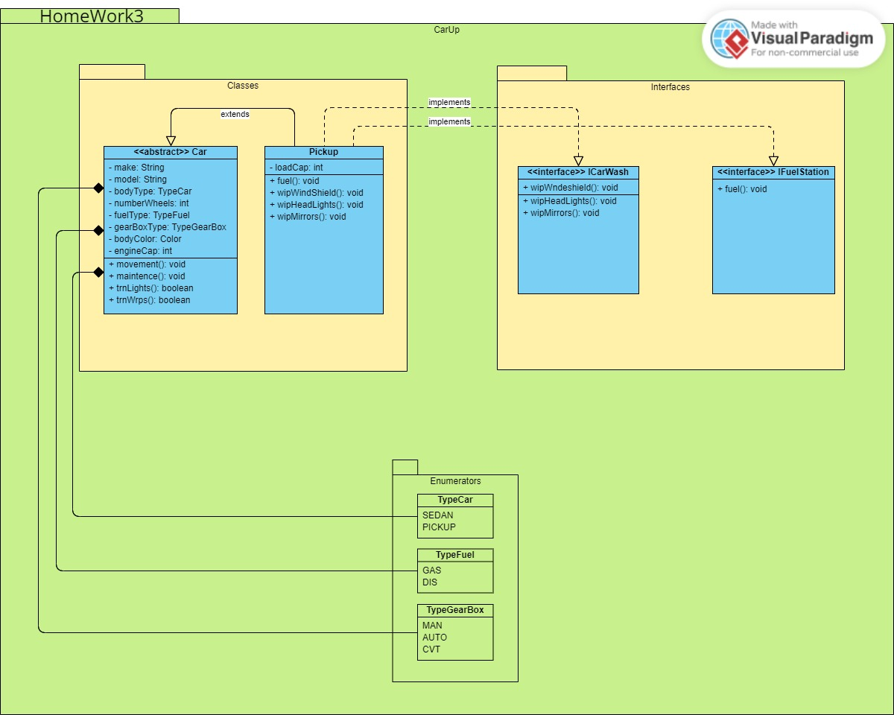

# Домашнее задание 3

## Задание:

По разработанному коду нарисовать UML диаграмму. 
Сдаем в формате JPG. 
Онлайн ресурс редактор (https://online.visual-paradigm.com/)

## Выполнение:

Доступ с самого проекта:

Доступ с облака:

